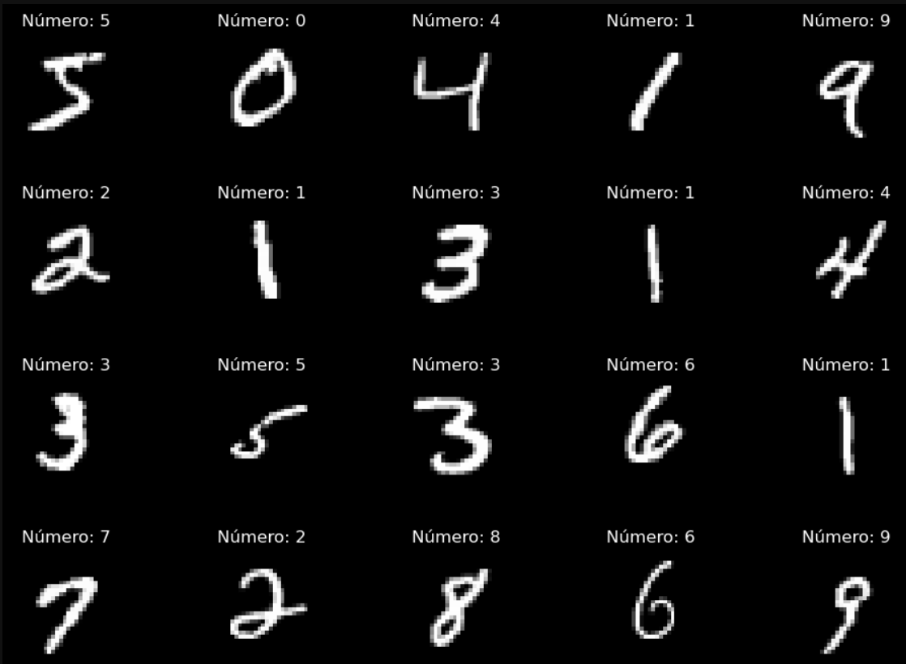
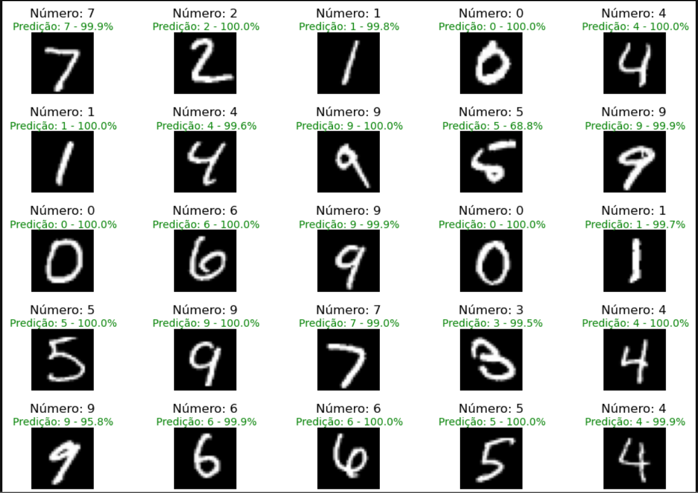

# Reconhecimento de Dígitos Manuscritos com Redes Neurais Convolucionais



Este repositório apresenta o desenvolvimento completo de um projeto de reconhecimento de dígitos manuscritos utilizando redes neurais convolucionais (CNNs). O objetivo principal foi explorar diferentes arquiteturas de modelos, ajustar hiperparâmetros e validar o modelo com dados externos, garantindo sua robustez e capacidade de generalização.

## Organização do projeto




## Organização do projeto

```
├── .gitignore         <- Arquivos e diretórios a serem ignorados pelo Git
├── ambiente.yml       <- O arquivo de requisitos para reproduzir o ambiente de análise
├── LICENSE            <- Licença de código aberto (MIT)
├── README.md          <- README principal para desenvolvedores que usam este projeto.
|
├── dados              <- Arquivos de dados para o projeto.
|                      <- Pasta test_images
├── notebooks          <- Jupyter Notebooks.
│
|   └──src             <- Código-fonte para uso neste projeto.
|      │
|      ├── __init__.py  <- Torna um módulo Python
|      ├── config.py    <- Configurações básicas do projeto
| 
|
├── referencias        <- Sobre a Base.
|
├── imagens            <- Imagens utilizadas no projeto
```


## Configuração do ambiente

1. Faça o clone do repositório.

    ```bash
    git clone git@github.com:HugoLeandro/Projeto_MNIST.git
    ```

2. Crie um ambiente virtual para o seu projeto utilizando o `conda`.

    ```bash
    conda env create -f ambiente.yml --name mnist_env
    ```

3. Ative o ambiente.

    ```bash
    conda activate mnist_env
    ```

4. Instale as dependências adicionais, se necessário.

## Bibliotecas utilizadas

- Python 3.8+
- TensorFlow/Keras
- Matplotlib
- NumPy
- Pandas
- Scikit-learn
- Jupyter Notebook

## Desenvolvimento do projeto

O projeto foi desenvolvido em etapas progressivas para garantir um aprendizado incremental e a robustez do modelo.

### 1. Modelo Básico
Iniciamos com um modelo simples baseado em camadas densas, utilizando TensorFlow e Keras. Esse modelo foi um ponto de partida para entender os desafios do problema.

### 2. Introdução de CNNs
A complexidade foi adicionada ao incluir redes neurais convolucionais, pooling e dropout. Essas alterações melhoraram significativamente o desempenho e reduziram o overfitting.

### 3. Data Augmentation
Utilizamos técnicas de data augmentation como RandomRotation, RandomTranslation e RandomZoom para aumentar a robustez do modelo e simular cenários reais.

### 4. Ajuste de Hiperparâmetros
Com o auxílio do Keras Tuner, exploramos diferentes combinações de hiperparâmetros, incluindo o número de filtros, tamanhos de kernel e taxas de aprendizado.

### 5. Validação com Dados Externos
Testamos o modelo com imagens criadas manualmente no Paint para avaliar sua capacidade de generalização fora do ambiente controlado.

## Validação em Dados Externos

Criamos imagens de teste no Paint com resolução de 128x128, fundo branco e dígitos pretos, que foram redimensionadas para 28x28. Esses dados foram utilizados para validar a robustez do modelo.

## Resumo dos principais resultados

- **Acurácia nos dados de teste (MNIST):** Acima de 99%.
- **Desempenho em dados externos:** Excelente precisão em imagens criadas manualmente, mas com resultados mais variados dependendo da qualidade das imagens.

## Como testar com seus próprios dados?

1. Crie suas imagens com resolução 128x128 e salve-as na pasta `test_images` dentro da pasta `dados`.
2. Execute o script de avaliação para testar suas imagens no modelo.

## Reflexões

- A validação além do ambiente controlado é essencial para avaliar a generalização do modelo.
- Mesmo modelos simples podem ser suficientes para problemas básicos, como o MNIST.
- Ajustar hiperparâmetros e aplicar técnicas de data augmentation são passos cruciais para desenvolver modelos robustos.

Sinta-se à vontade para explorar este repositório, criar suas próprias imagens de teste e compartilhar seus resultados!

## Licença

Este projeto está licenciado sob a licença MIT. Consulte o arquivo LICENSE para mais detalhes.

